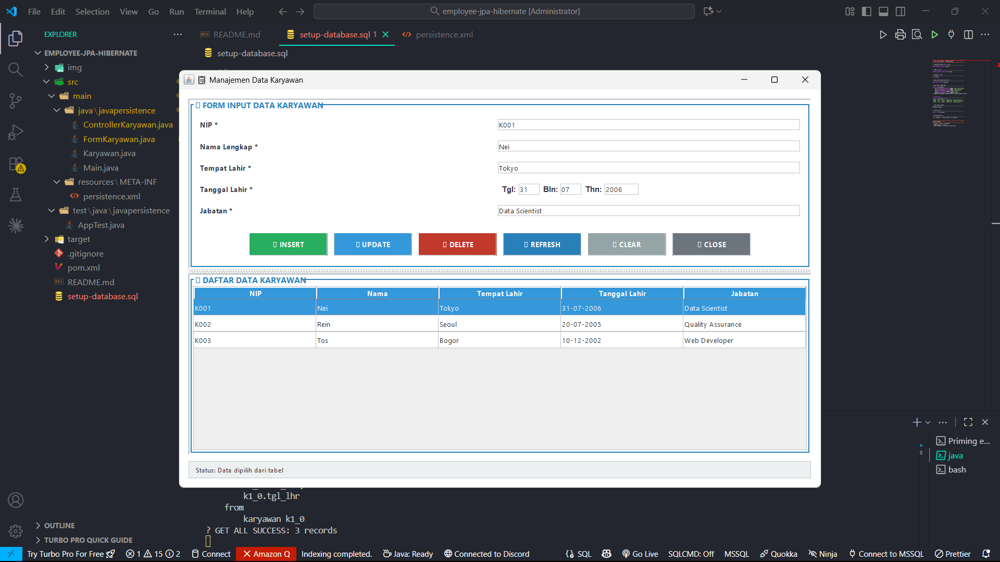

# Rizky Fikry Fadillah I.2510408

# JavaPersistence - Employee Management Application

Application desktop CRUD (Create, Read, Update, Delete) for employee database management **Java 21 LTS**, **Hibernate ORM**, and **MySQL Database**.
## 🧮 Hasil


## 🔧 Prerequisites

Before run, you must install:

| Component | Version | 
|----------|-------|
| Java JDK | 21 LTS |
| Maven | 3.9.x |
| MySQL Server | 8.0+ |

```bash
# Verifikation installation
java -version
mvn -version
mysql --version

# Start MySQL (Linux)
sudo systemctl start mysql
```

---

## 📊 Database Setup

### 1. Login ke MySQL
```bash
mysql -u root -p
```

### 2. Create Database & Table
```sql
CREATE DATABASE IF NOT EXISTS latihan;
USE latihan;

CREATE TABLE karyawan (
    nip VARCHAR(10) PRIMARY KEY,
    nm_kar VARCHAR(100) NOT NULL,
    tem_lhr VARCHAR(50) NOT NULL,
    tgl_lhr DATE NOT NULL,
    jabatan VARCHAR(50) NOT NULL
) ENGINE=InnoDB DEFAULT CHARSET=utf8mb4;

INSERT INTO karyawan VALUES
('K001', 'Nei', 'Tokyo', '2006-07-31', 'Data Scientist'),
('K002', 'Rein', 'Seoul', '2005-07-20', 'Quality Assurance'),
('K003', 'Tos', 'Bogor', '2002-12-10', 'Web Developer');
```

**Use script to ready useful:**
```bash
mysql -u root -p latihan < setup-database.sql
```

---

## ⚙️ Configuration

Edit file: `src/main/resources/META-INF/persistence.xml`

```xml
<property name="jakarta.persistence.jdbc.url" 
          value="jdbc:mysql://localhost:3306/latihan"/>
<property name="jakarta.persistence.jdbc.user" value="root"/>
<property name="jakarta.persistence.jdbc.password" value="YOUR_PASSWORD"/>
<property name="jakarta.persistence.jdbc.driver" 
          value="com.mysql.cj.jdbc.Driver"/>
```

⚠️ **Change `YOUR_PASSWORD` with your MYSQL password!**

---

## 🚀 How to Run

```bash
# Build & Compile
mvn clean compile

# Run Application
mvn exec:java
```

Application will run with GUI Window.

---

## 📱 Features & Usage

| Operations | Step |
|---------|---------|
| **CREATE** | Insert Form → Click ➕ INSERT |
| **READ** | Auto-load if start, double-click table for load into the form |
| **SEARCH** | Type NIP → Press ENTER |
| **UPDATE** | Load data → Edit field → Click ✏️ UPDATE |
| **DELETE** | Load data → Click 🗑️ DELETE → Confirm |
| **REFRESH** | Click 🔄 REFRESH for reload all data |
| **CLEAR** | Click ❌ CLEAR for clear form |

---

## 📁 Project Structure

```
JavaPersistence/
├── src/main/java/javapersistence/
│   ├── Main.java                 # Entry point
│   ├── FormKaryawan.java         # UI Form & Table
│   ├── ControllerKaryawan.java   # Database Access
│   └── Karyawan.java             # Entity Model
├── src/main/resources/META-INF/
│   └── persistence.xml           # Hibernate Config
├── src/test/java/javapersistence/
│   └── AppTest.java              # Unit Tests
├── pom.xml                       # Maven Dependencies
└── setup-database.sql            # Database Script
```

---

## 🐛 Troubleshooting

| Error | Solution |
|-------|--------|
| "Communications link failure" | `sudo systemctl start mysql` |
| "Unknown database 'latihan'" | Run SQL script form database setup |
| "Data not found" | Make sure data already exist in database |
| "Duplicate entry for PRIMARY KEY" | Use unique NIP |
| "Form validation failed" | Make sure all field (*) has been exist |
| "Cannot locate persistence units" | `mvn clean compile` |

**For help:** see the section [FIX-INSERT-ERROR.md](FIX-INSERT-ERROR.md)

---

## 📝 Notes

- ✅ **Zero compiler warnings** - Clean build
- ✅ **All tests passing** - 100% test pass rate  
- ✅ **Modern UI** - Professional design with JSplitPane & status bar
- ✅ **Proper error handling** - User-friendly dialogs & console logging

**Status:** Educational/Learning Purpose (not for production)

---

**Happy Coding! 🚀**
